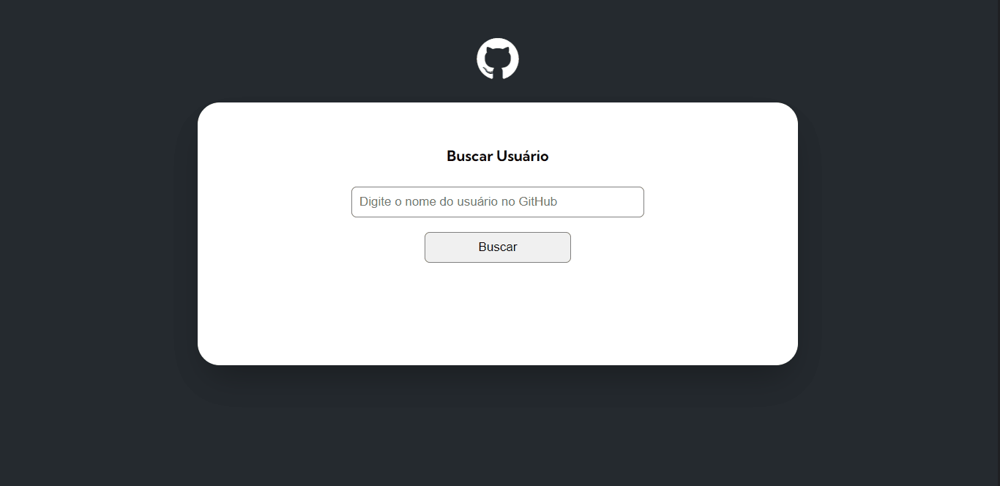

# projeto-fetch-github-api

## Sobre o projeto

Esse projeto foi feito durante o curso **DevQuest - Dev em Dobro** onde usamos alguns conhecimentos que aprendemos ao longo dos módulos para criar um projeto que consome a **API do github** usando o **fetch** para buscar informações dos usuários e mostrar em tela.

## Recursos

- **Busca interativa:** os usuários podem inserir o nome de um usuário do GitHub na barra de busca para obter informações do perfil.

- **Exibição dos dados:** após a busca, os detalhes do usuário são mostrados, incluindo nome, foto de perfil, bio e repositórios.

- **Integração com a Fetch API:** a aplicação utiliza a Fetch API para realizar chamadas assíncronas à API do GitHub, tornando a busca rápida e responsiva.

- **JavaScript puro:** o projeto foi desenvolvido utilizando somente HTML, CSS e JavaScript puro, sem o uso de bibliotecas externas, proporcionando um aprendizado mais aprofundado sobre essas linguagens.